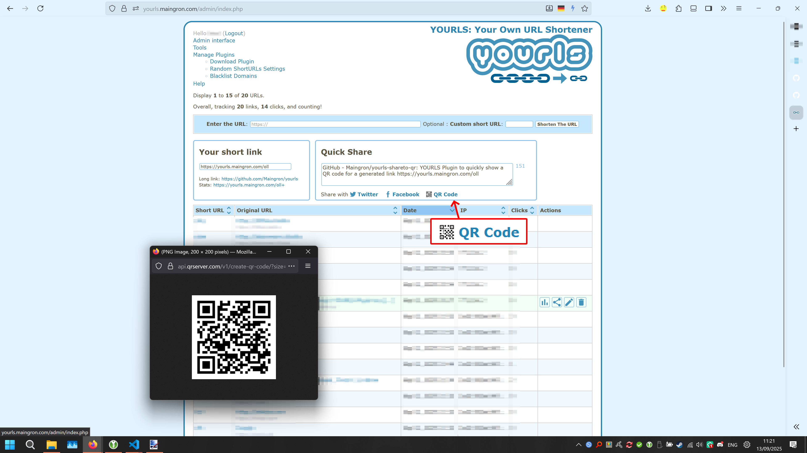
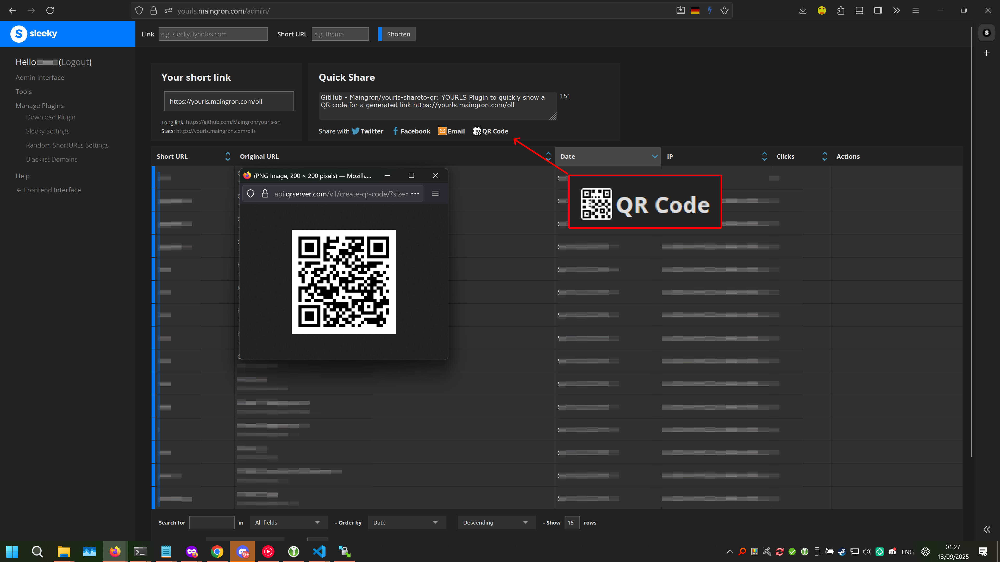

# yourls-shareto-qr

Plugin for [YOURLS](http://yourls.org) that implements a simple QR code display for the url list quick sharing

Place in /user/plugins/shareto-qr

Activate in "manage plugins"

It will be added under admin interface -> share button ("Quick Share") next to Facebook and other sharing options.

Thank you to [Peter Ryan Berbec](https://havetechwilltravel.nyc/) for the original "Mailto: quickshare" plugin, which this is based on.

## Screenshots

